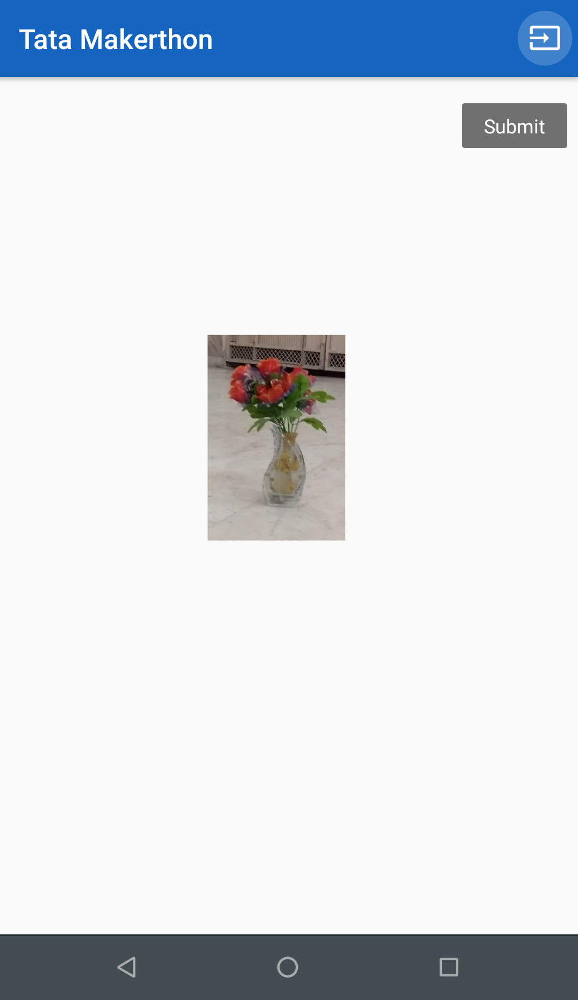

# TataMakerthon

An android application that is used in the project for performing the following tasks - Capturing and Cropping Image. Sending it to the specific server IP address. Receiving it when the Server sends it back after performing some Matching with the nearby real life objects.

# Screenshots

        

https://docs.google.com/document/d/1OhixD92MSdEeoMHW1w8XtnOULdEBlTycy6yQiRJk1Zg/
https://drive.google.com/open?id=1-QNsM6y24Tk9ZnKmpD0l58VW7dAGvL8C
